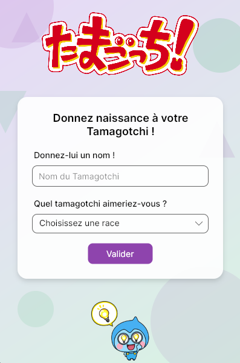

# 🐣 Tamagotchi

Un Tamagotchi virtuel développé en **C# / AvaloniaUI**, dans le cadre d'un projet pédagogique.



## 📖 Description

Ce projet reproduit le concept du jouet virtuel *Tamagotchi* : l'utilisateur crée sa créature (nom + race), puis peut interagir avec elle au quotidien à travers plusieurs actions.

## ✨ Fonctionnalités

- **Création du Tamagotchi** : choix d'un nom et d'une race (Chat, Chien, Lapin)
- **Interface de jeu** avec un ensemble d'actions disponibles :
    - 🎮 Jouer
    - 🍖 Nourrir
    - ⚠️ Gronder
    - 💼 Travailler
    - 😴 Dormir
- Navigation entre les écrans sans ouverture de nouvelles fenêtres (changement de vue dans la même fenêtre)

## 🛠️ Stack technique

- **Langage** : C#
- **Framework UI** : [AvaloniaUI](https://avaloniaui.net/)
- **.NET** : net10.0

## 🚀 Lancer le projet

### Prérequis

- [.NET SDK](https://dotnet.microsoft.com/download) (version compatible net10.0)

### Démarrage

```bash
git clone <url-du-repo>
cd Tamagotchi
dotnet run
```

## 📂 Structure du projet

```
Tamagotchi/
├── MainWindow.axaml        # Fenêtre principale, conteneur des vues
├── CreationView.axaml      # Écran de création du Tamagotchi
├── view/
│   └── GameView.axaml      # Écran de jeu / interactions
├── assets/                 # Images et ressources visuelles
└── docs/
    └── preview.png         # Capture d'écran de l'application
```

## 🎓 Contexte

Projet réalisé à but pédagogique, dans le cadre d'un BTS SIO (option SLAM).

## 📝 Licence

Projet éducatif — libre d'utilisation à des fins d'apprentissage.